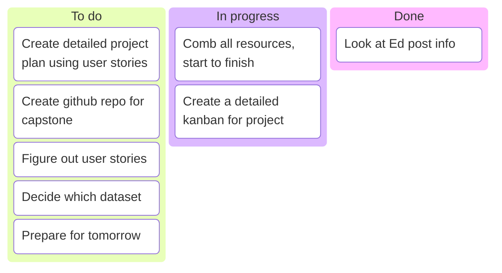
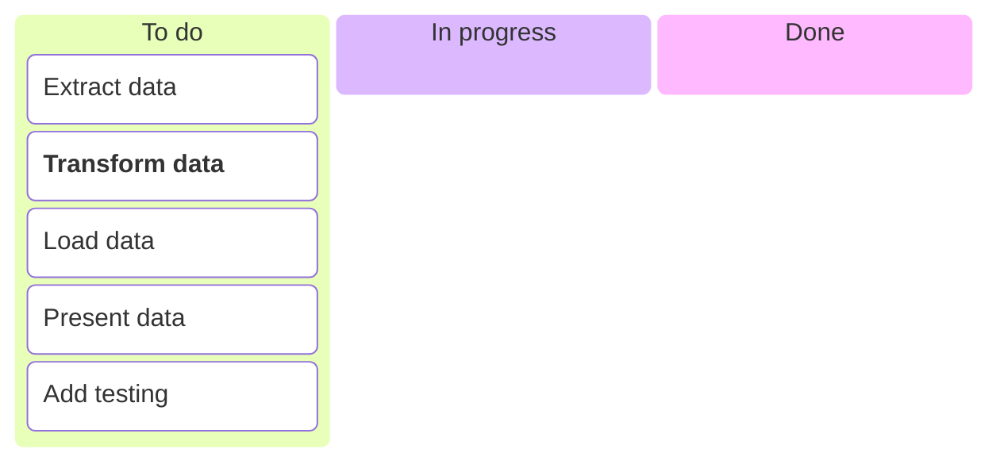
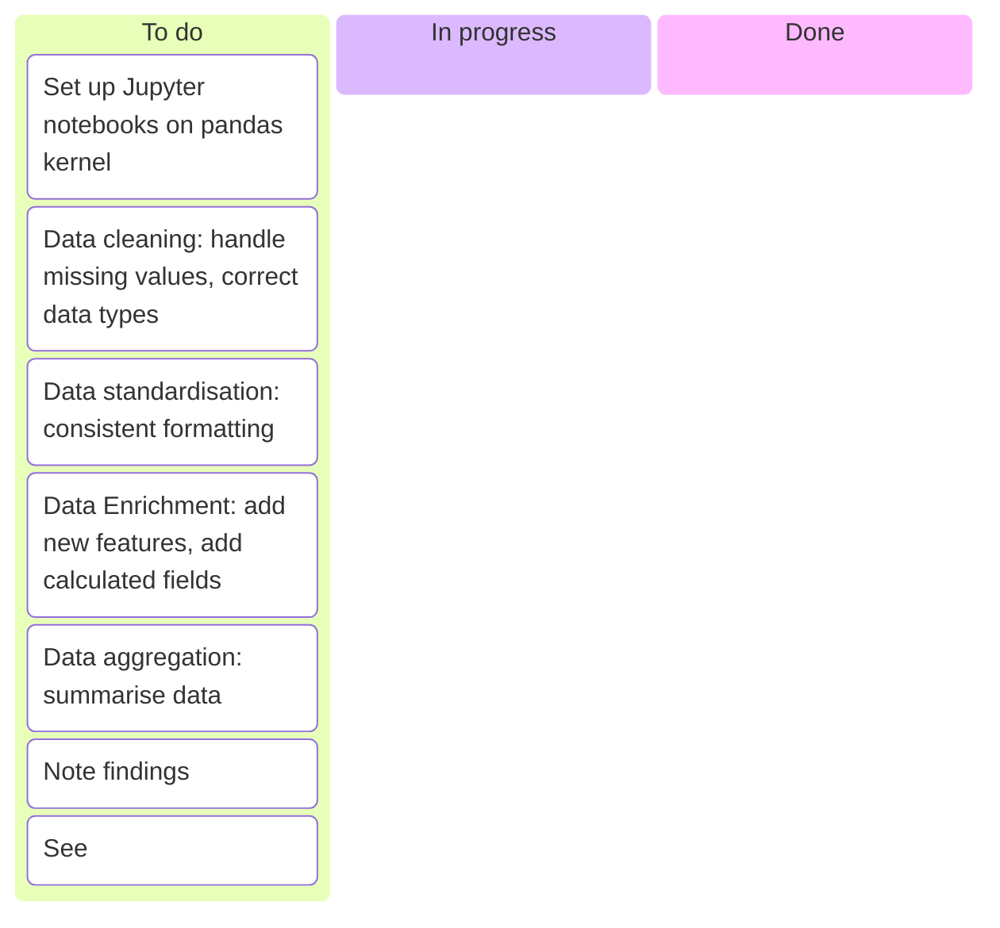
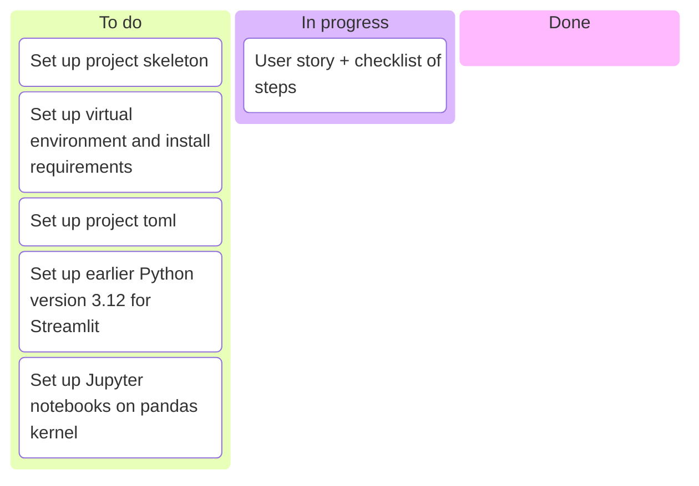
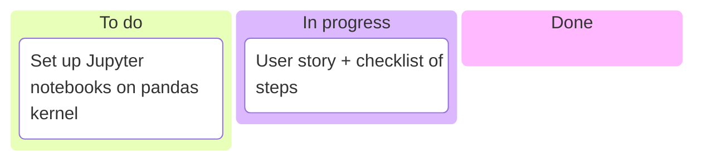
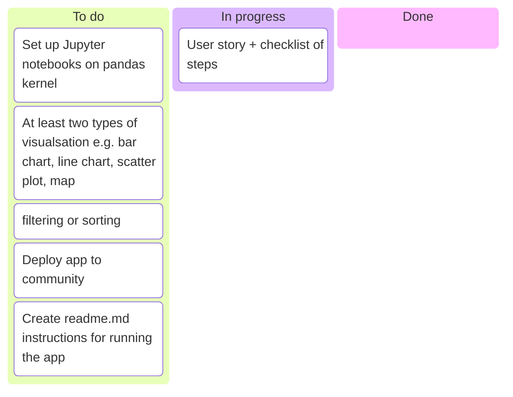

# First  

```mermaid
kanban
    To do 
        Create detailed project plan using user stories
        Create github repo for capstone 
        (Figure out user stories)
        (Decide which dataset)
        (Prepare for tomorrow)
        

    In progress
        Comb all resources, start to finish
        Create a detailed kanban for project 

    Done
        Look at Ed post info
```

# Overall 

```mermaid
kanban
    To do 
        Extract data
        **Transform data**
        Load data 
        Present data 
        Add testing 
    In progress  

    Done
```

# Exploratory Data Analysis

```mermaid
kanban
    To do 
        Set up Jupyter notebooks on pandas kernel
        Data cleaning: handle missing values, correct data types
        Data standardisation: consistent formatting 
        Data Enrichment: add new features, add calculated fields 
        Data aggregation: summarise data 
        Note findings 
        See 

    In progress


    Done
```

# Extract

```mermaid
kanban
    To do 
        Set up project skeleton
        Set up virtual environment and install requirements
        Set up project toml
        Set up earlier Python version 3.12 for Streamlit
        Set up Jupyter notebooks on pandas kernel 

    In progress 
        User story + checklist of steps

    Done
```

# Transform

```mermaid
kanban
    To do 
        Set up Jupyter notebooks on pandas kernel 

    In progress
        User story + checklist of steps

    Done
```

# Load

```mermaid
kanban
    To do 
        Set up Jupyter notebooks on pandas kernel 

    In progress
        User story + checklist of steps
    Done
```

# Streamlit 

```mermaid
kanban
    To do 
        Set up Jupyter notebooks on pandas kernel 
        At least two types of visualsation e.g. bar chart, line chart, scatter plot, map
        Interactive visual (filtering or sorting)
        Deploy app to community 
        Create readme.md instructions for running the app 

    In progress 
        User story + checklist of steps

    Done
```

