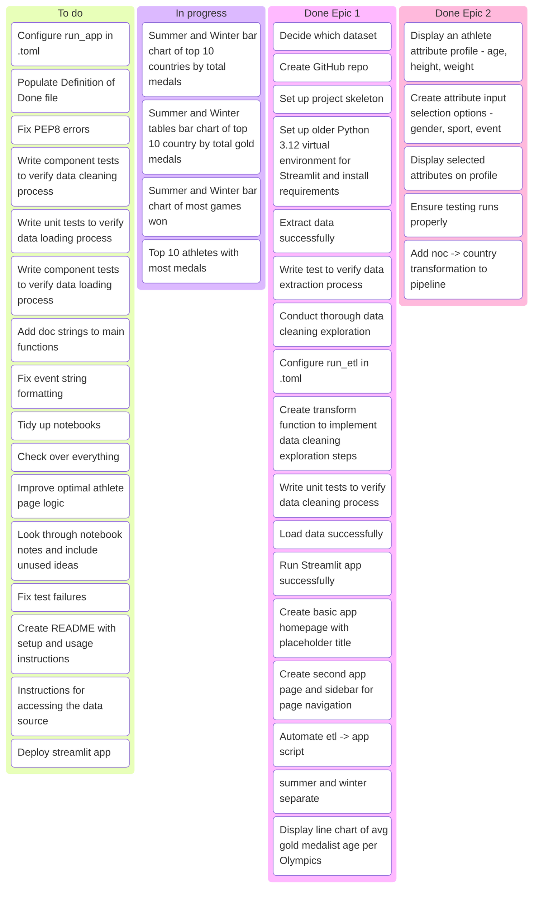
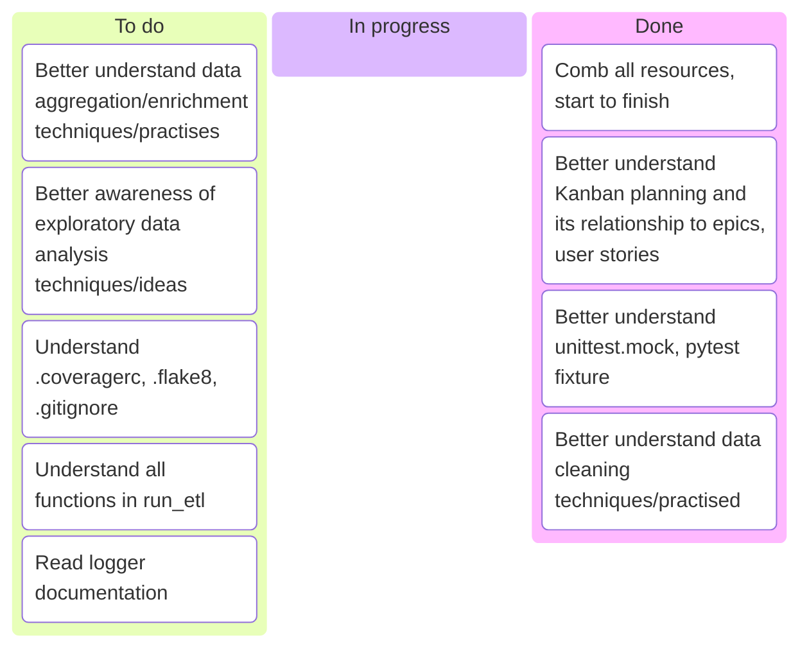

# Project Kanban 

```mermaid
kanban
    To do
        Configure run_app in .toml
        Populate Definition of Done file
        Fix PEP8 errors
        Write component tests to verify data cleaning process 
        Write unit tests to verify data loading process 
        Write component tests to verify data loading process 
        Add doc strings to main functions
        Fix event string formatting
        Tidy up notebooks
        Check over everything       
        Improve optimal athlete page logic 
        Look through notebook notes and include unused ideas
        Fix test failures 
        Create README with setup and usage instructions
        Instructions for accessing the data source
        Deploy streamlit app 

    In progress
        Summer and Winter bar chart of top 10 countries by total medals
        Summer and Winter tables bar chart of top 10 country by total gold medals
        Summer and Winter bar chart of most games won
        Top 10 athletes with most medals

    Done Epic 1
        Decide which dataset
        Create GitHub repo 
        Set up project skeleton
        Set up older Python 3.12 virtual environment for Streamlit and install requirements
        Extract data successfully
        Write test to verify data extraction process
        Conduct thorough data cleaning exploration
        Configure run_etl in .toml
        Create transform function to implement data cleaning exploration steps
        Write unit tests to verify data cleaning process 
        Load data successfully
        Run Streamlit app successfully
        Create basic app homepage with placeholder title
        Create second app page and sidebar for page navigation
        Automate etl -> app script
        Display ordered bar chart of avg age per event (summer and winter separate)
        Display line chart of avg gold medalist age per Olympics

    Done Epic 2 
        Display an athlete attribute profile - age, height, weight
        Create attribute input selection options - gender, sport, event
        Display selected attributes on profile 
        Ensure testing runs properly
        Add noc -> country transformation to pipeline 
        
```

# Learning Backlog  

```mermaid
kanban
    To do 
        
        Better understand data aggregation/enrichment techniques/practises
        Better awareness of exploratory data analysis techniques/ideas
        Understand .coveragerc, .flake8, .gitignore
        Understand all functions in run_etl 
        Read logger documentation
        
    In progress  
        
        

    Done
        Comb all resources, start to finish
        Better understand Kanban planning and its relationship to epics, user stories
        Better understand unittest.mock, pytest fixture 
        Better understand data cleaning techniques/practised
```

