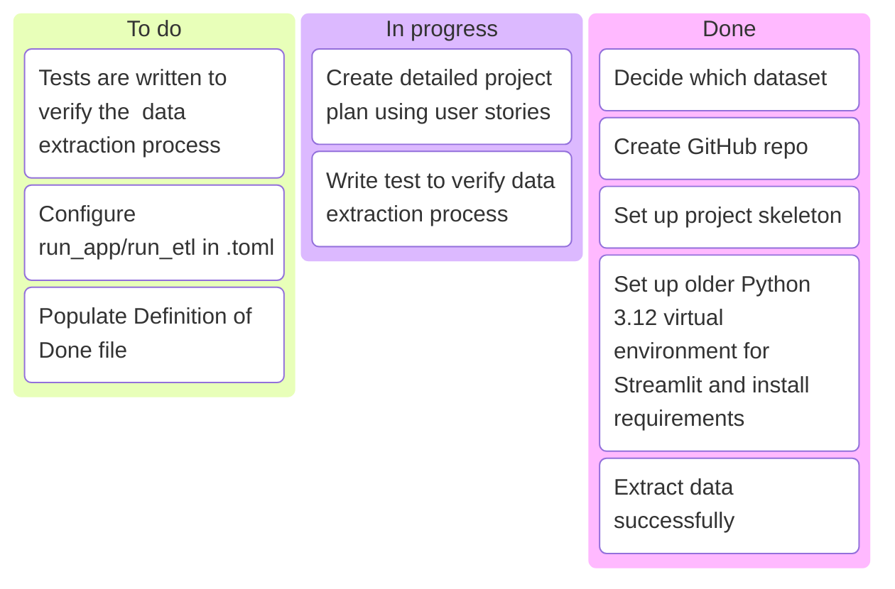
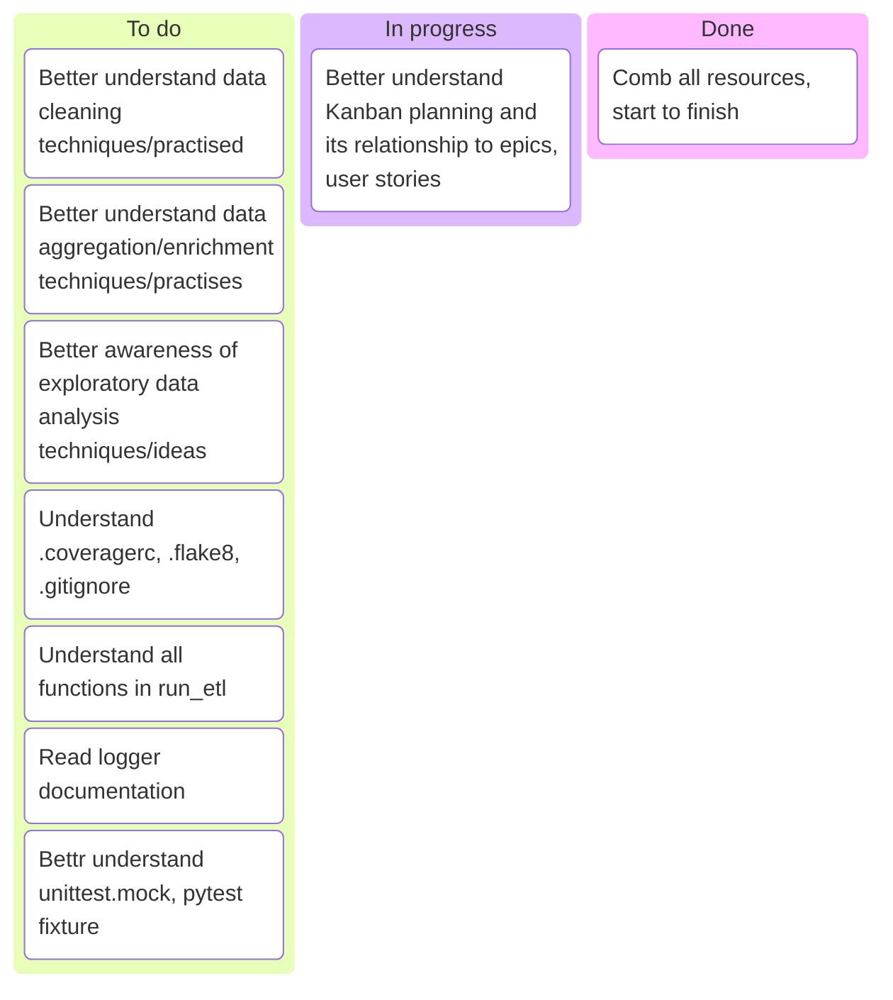

# Project Kanban 

```mermaid
kanban
    To do   

        

        

        Tests are written to verify the  data extraction process

        Configure run_app/run_etl in .toml

        Populate Definition of Done file

    In progress
        
        Create detailed project plan using user stories
        Write test to verify data extraction process
        

    Done
        Decide which dataset
        Create GitHub repo 
        Set up project skeleton
        Set up older Python 3.12 virtual environment for Streamlit and install requirements
        Extract data successfully
        
```

# Learning Backlog  

```mermaid
kanban
    To do 
        Better understand data cleaning techniques/practised
        Better understand data aggregation/enrichment techniques/practises
        Better awareness of exploratory data analysis techniques/ideas
        Understand .coveragerc, .flake8, .gitignore
        Understand all functions in run_etl 
        Read logger documentation
        Bettr understand unittest.mock, pytest fixture 
        
    In progress  
        

        Better understand Kanban planning and its relationship to epics, user stories

    Done
        Comb all resources, start to finish
```

