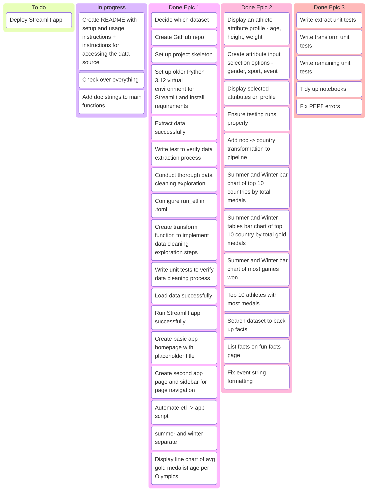
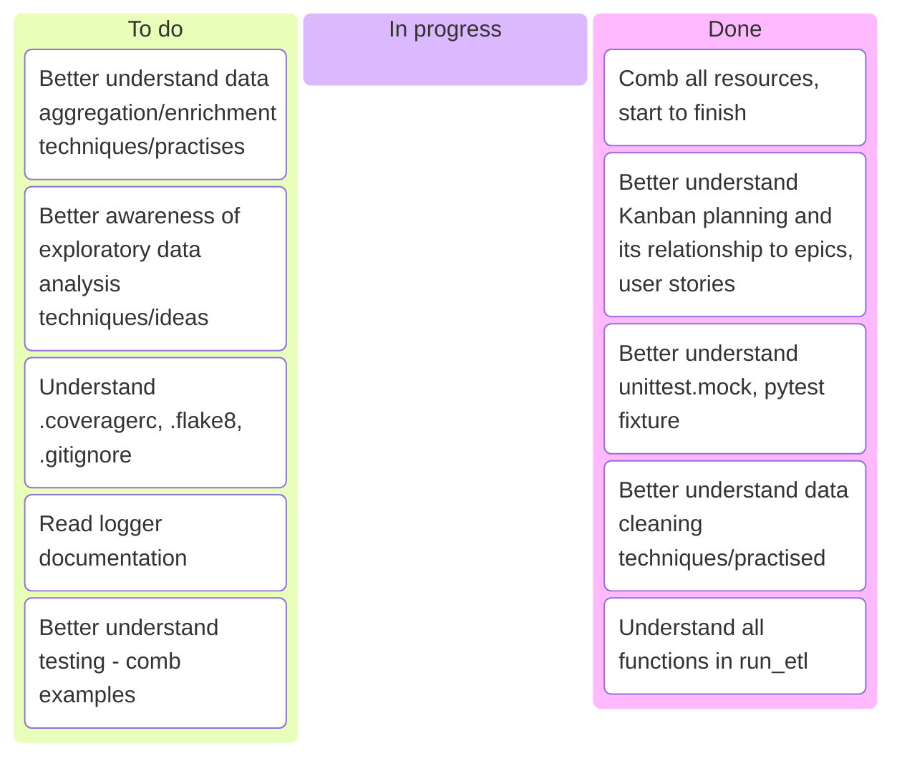

# Project Kanban 

# Learning Backlog  

### Presentation 
- Focus on the project approach and the project development
- See rubric: The following are graded on a 0-3 basis (0 = not at all, 1 = partially, 2 = explained, 3 = explained in depth)
    - Goals Outlined
    - Choice of Data
    - Extract
    - Transform
    - Load
    - Technical Depth (including testing)
    - Steamlit
    - Insights
    - Challenges and Takeaways
    - Future Dev
    - Flow
    - Presentation Style