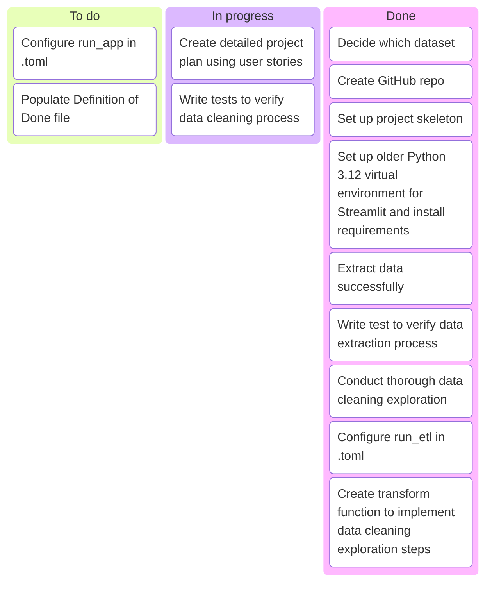
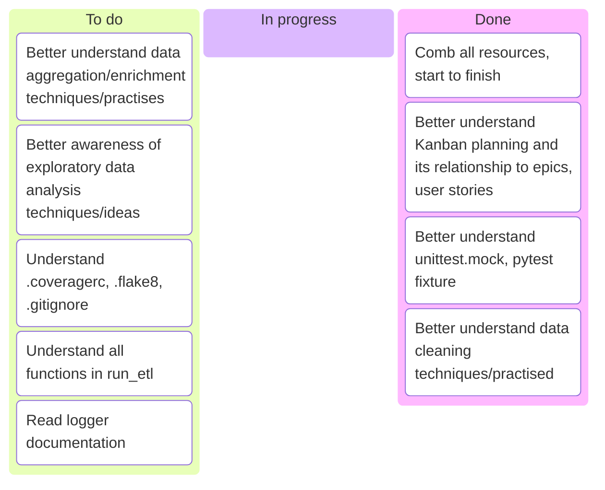

# Project Kanban 

```mermaid
kanban
    To do
        Configure run_app in .toml
        Populate Definition of Done file

    In progress
        Create detailed project plan using user stories
        Write tests to verify data cleaning process 

    Done
        Decide which dataset
        Create GitHub repo 
        Set up project skeleton
        Set up older Python 3.12 virtual environment for Streamlit and install requirements
        Extract data successfully
        Write test to verify data extraction process
        Conduct thorough data cleaning exploration
        Configure run_etl in .toml
        Create transform function to implement data cleaning exploration steps
        
```

# Learning Backlog  

```mermaid
kanban
    To do 
        
        Better understand data aggregation/enrichment techniques/practises
        Better awareness of exploratory data analysis techniques/ideas
        Understand .coveragerc, .flake8, .gitignore
        Understand all functions in run_etl 
        Read logger documentation
        
    In progress  
        
        

    Done
        Comb all resources, start to finish
        Better understand Kanban planning and its relationship to epics, user stories
        Better understand unittest.mock, pytest fixture 
        Better understand data cleaning techniques/practised
```

